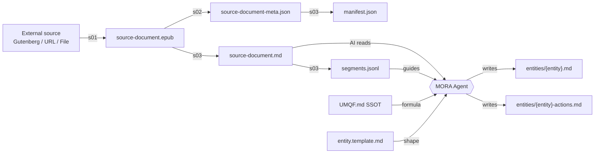
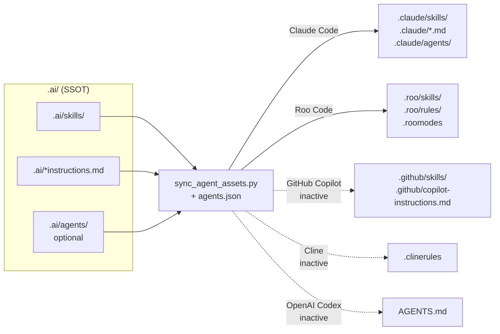
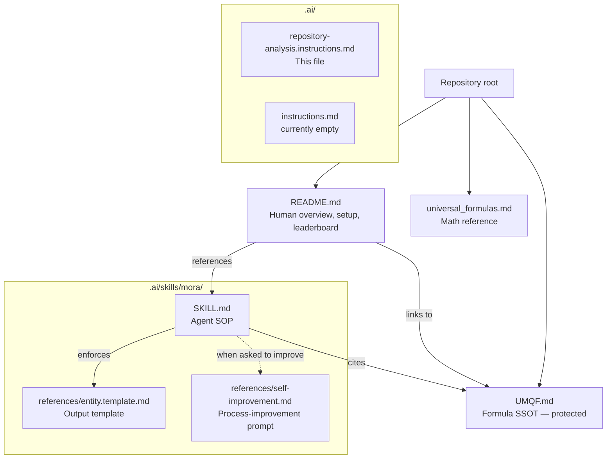

==== START OF INSTRUCTIONS FROM: repository-analysis.instructions.md ====

# Instructions from: repository-analysis.instructions.md

# Repository Analysis: UMQF / MORA

## 1. Repository Overview

This repository hosts the **Universal Moral Quotient Formula (UMQF)** — a mathematical framework that quantifies morality as the impact of an action on survival odds — and **MORA**, the AI-agent workflow that applies the formula to real documents (books, articles, transcripts) to produce per-entity moral profiles.

The repo is a hybrid of three things:
- A **specification** (`UMQF.md` at the repo root) that is the single source of truth for the formula, variables, and output format.
- A **skill-driven AI agent** (`.ai/skills/mora/`) containing the Standard Operating Procedure, Python ingestion pipeline, and output templates that an LLM (via Claude Code, Roo Code, etc.) uses to analyze a document.
- A **dataset of analyses** (`MORA/analysis/`) — 12 processed documents with ~99 entity profiles — that both demonstrate the system and serve as reference outputs.

Primary audiences: AI safety researchers, game-design engineers building moral-agent NPCs, policy/legal framework authors, and AI coding agents asked to run or improve a morality assessment.

## 2. Top-Level Structure

| Path | Purpose |
|------|---------|
| `UMQF.md` | **Formula SSOT.** Core specification of the Universal Moral Quotient Formula. Protected — never modified by the MORA workflow. |
| `universal_formulas.md` | Reference catalogue of mathematical distributions (Normal, Power Law, Exponential Decay, Logistic Growth, Inverse Square Law). |
| `README.md` | Human-facing project overview: motivation, formula summary, setup instructions, analyzed-entity leaderboard. |
| `.markdownlint.json` | Markdown lint config (disables MD013/MD033/MD041, restricts MD024 to siblings). |
| `.gitignore` | Only excludes `.vs`. |
| `.ai/` | **Single source of truth for all AI agent assets.** Contains `instructions.md` (currently empty — all agent content lives in skills), `repository-analysis.instructions.md` (this file), and `skills/` (four skills). |
| `.claude/` | Generated. Claude Code agent assets synced from `.ai/` — do not edit directly. |
| `.roo/` | Generated. Roo Code agent assets (`rules/`, `skills/`) synced from `.ai/` — do not edit directly. |
| `MORA/analysis/` | **Dataset.** 12 analyzed documents, each with source EPUB/MD, metadata JSON, segment index, citation, and entity profile outputs. External links on the internet reference paths in this folder — it must stay put. |

Notes:
- `.github/` does not exist in this repo, so the Copilot sync target in `agents.json` is currently inactive.
- `.vs/` is a Visual Studio cache (gitignored).
- `.ai/.tmp/` is a scratch folder used by the `repository-analysis` skill and is cleaned up at the end of each run.

## 3. Technology Stack & Key Dependencies

### Core technologies
- **Python 3.x** — ingestion pipeline (all pinned versions from `.ai/skills/mora/requirements.txt`).
- **Markdown** — every non-binary artifact (specifications, instructions, outputs, templates).
- **EPUB** — canonical input format for the pipeline; other formats are normalized into EPUB first.
- **LLM via VS Code extension** — agent execution surface. README recommends Google Gemini (via OpenRouter or Google Cloud) through Roo Code; Claude Code is equally supported via `.claude/`.

### Python dependencies (from `.ai/skills/mora/requirements.txt`)

| Package | Minimum version | Role |
|---------|-----------------|------|
| `requests` | 2.31.0 | HTTP downloads (Gutenberg, generic URLs). |
| `beautifulsoup4` | 4.12.2 | HTML/XML parsing (EPUB OPF, HTML→Markdown). |
| `lxml` | 4.9.3 | Fast XML backend for BeautifulSoup. |
| `jsonschema` | 4.20.0 | JSON validation (declared but not currently invoked by shipped scripts). |
| `playwright` | 1.40.0 | Browser automation for commercial-book acquisition (connects to Edge/Chrome over CDP on port 9222). |
| `EbookLib` | 0.18 | Primary EPUB parser in `s03`; falls back to manual zipfile parsing if unavailable. |
| `markdownify` | 0.11.6 | Declared for HTML→Markdown (shipped scripts use a hand-rolled converter in `s03`). |

### Toolchain
- **Git** for version control.
- **Visual Studio Code** as the recommended editor.
- **Roo Code** or **Claude Code** (or any other agent platform whose assets live in `.ai/skills/`) as the AI execution environment.
- **Adobe Digital Editions 4.5**, **Calibre Portable**, and **DeDRM Tools** are documented in the README as optional prerequisites for converting purchased/DRM-protected eBooks to EPUB before handing them to the pipeline.

## 4. Architecture & Runtime Model

The system has three cleanly separated layers:

1. **Specification layer** — `UMQF.md` + `universal_formulas.md`. Static, protected, referenced by everything.
2. **Skill layer** — `.ai/skills/`. Agent instructions, helper scripts, and templates. `.ai/` is the single source of truth; a Python sync script mirrors it into agent-specific folders (`.claude/`, `.roo/`, and — when present — `.github/`).
3. **Data layer** — `MORA/analysis/`. File-based store of analyzed documents. The filesystem *is* the database; there is no runtime service.

### Component model

```mermaid
graph TD
    subgraph Spec["Specification (SSOT)"]
        UMQF[UMQF.md<br/>Formula]
        UF[universal_formulas.md<br/>Math reference]
    end

    subgraph Skills[".ai/skills/ (Source)"]
        MORA_SKILL[mora/SKILL.md]
        MORA_SCRIPTS[mora/scripts/<br/>s01, s02, s03, utils, runner]
        MORA_REFS[mora/references/<br/>entity.template.md<br/>self-improvement.md]
        AI_SELF[ai-self-improvement/<br/>sync_agent_assets.py<br/>agents.json]
        REPO_ANALYSIS[repository-analysis/SKILL.md]
        SKILL_CREATOR[skill-creator/]
    end

    subgraph Agents["Agent mirrors (generated)"]
        CLAUDE[.claude/skills/]
        ROO[.roo/skills/]
    end

    subgraph Data["MORA/analysis/ (Outputs)"]
        DOC[document/<br/>source + manifest + segments]
        ENT[document/entities/<br/>{entity}.md<br/>{entity}-actions.md]
    end

    AI_SELF -->|sync| CLAUDE
    AI_SELF -->|sync| ROO
    MORA_SKILL -->|references| UMQF
    MORA_SKILL -->|references| MORA_REFS
    MORA_SKILL -->|invokes| MORA_SCRIPTS
    MORA_SCRIPTS -->|writes| DOC
    MORA_SKILL -->|produces| ENT
    MORA_REFS -->|shapes| ENT
```

### Runtime model

There is no long-running server. A "run" means: a developer invokes an AI agent, the agent loads the `mora` skill description into context, and (when triggered by a morality-assessment request) executes the SOP in `SKILL.md` — which mixes shell commands (the Python pipeline) and LLM reasoning (identifying entities, computing UMQ values, writing profiles).

## 5. Project Inventory

### Skills (under `.ai/skills/`)

| Skill | Role | Key bundled assets |
|-------|------|--------------------|
| `mora` | The morality-assessment SOP. Analyzes a document and produces `{entity}.md` + `{entity}-actions.md` profiles per the formula. | `SKILL.md`, `scripts/` (6 Python files), `references/entity.template.md` (output template), `references/self-improvement.md` (meta-prompt for improving the MORA process), `requirements.txt`. |
| `ai-self-improvement` | Governance for `.ai/` itself. Propagates instruction/skill/agent changes to every configured AI platform. | `SKILL.md`, `agents.json` (per-platform sync targets), `scripts/sync_agent_assets.py` (cross-platform Python, requires 3.8+). |
| `repository-analysis` | Generates and refreshes this file. | `SKILL.md`. |
| `skill-creator` | Scaffolding and iterative eval framework for new skills. | `SKILL.md`, `scripts/`, `references/`, `agents/`, `assets/`, `eval-viewer/`, `LICENSE.txt`. |

### MORA Python pipeline (`.ai/skills/mora/scripts/`)

| Script | Input | Output | Role |
|--------|-------|--------|------|
| `s01_search_and_download_book.py` | `--id <gutenberg>`, `--url`, `--file`, or `--search` + `--document <slug>` | `MORA/analysis/{doc}/source-document.epub`, `manifest.json` (initial) | Acquires EPUB from Project Gutenberg, a generic URL, or a local file. `--search` falls back to a commercial-store Playwright flow over Edge/Chrome CDP port 9222. |
| `s02_extract_metadata.py` | `MORA/analysis/{doc}/source-document.epub` | `MORA/analysis/{doc}/source-document-meta.json` | Reads EPUB OPF, extracts Dublin Core metadata (title, authors, language, identifiers, date, publisher, description, rights). |
| `s03_convert_to_markdown.py` | EPUB + optional meta JSON | `source-document.md`, `segments.jsonl`, updated `manifest.json`, `citation.md` | Converts EPUB HTML to Markdown via EbookLib (zipfile fallback), detects chapter boundaries, emits segment index for large-document chunking. |
| `run_pipeline_test.py` | Interactive | Runs s01 → s02 → s03 for a chosen document | Menu-driven orchestrator; discovers documents under `MORA/analysis/` and runs the three-step pipeline against the selection. |
| `utils_check_size.py` | File path | Line/char count + `SMALL`/`LARGE` status (threshold: 10,000 lines) | Size check used by the agent before reading `source-document.md` into context. |
| `utils_extract_segment.py` | `--input`, `--start`, `--end`, `--output` | Extracted line range | Segment extractor for iterative processing of LARGE documents; writes to `temp_segment.md` by convention. |

All four orchestration scripts compute `WORKSPACE_ROOT = os.path.join(os.path.dirname(__file__), "..", "..", "..", "..")` (four levels up from `.ai/skills/mora/scripts/` to the repo root) and address analysis data as `MORA/analysis/{document}/...`.

### Analysis dataset (`MORA/analysis/`)

Twelve analyzed documents, each a folder with the same layout:

```
MORA/analysis/{document}/
├── source-document.epub          # Acquired input (s01)
├── source-document.md            # Canonical text (s03)
├── source-document-meta.json     # Dublin Core metadata (s02)
├── manifest.json                 # Document metadata + pipeline status
├── segments.jsonl                # Chapter index for chunking (s03)
├── citation.md                   # Bibliographic citation (s03)
└── entities/
    ├── {entity}.md               # Entity moral profile (follows entity.template.md)
    └── {entity}-actions.md       # Detailed action-by-action UMQ math
```

Current documents: `bhagavad-gita`, `bible`, `einstein`, `elon-musk`, `enders-game`, `exploration-team`, `hitler-kershaw`, `jekyll-hyde`, `jordan-peterson`, `koran`, `steve-jobs`, `team-of-rivals`. Total of ~99 entity profile/action files. `exploration-team` is the canonical example referenced throughout the instructions.

## 6. Dependency & Data Flow

### Pipeline data flow



### Skill sync flow



`AUTO` mode of the sync script only touches agents whose target folders already exist, which is currently **Roo Code** and **Claude Code**. Other targets in `agents.json` (Cline, GitHub Copilot, OpenAI Codex) are configured but dormant in this repo.

## 7. Build, Test, CI/CD & Operational Workflows

There is no build step (pure Python + Markdown) and no CI service configured (no `.github/workflows/`). All workflows are developer- or agent-invoked commands.

### Initial setup

```bash
git clone https://github.com/JocysCom/UMQF.git
cd UMQF
pip install -r .ai/skills/mora/requirements.txt
playwright install          # Only needed if using --search commercial fallback
```

### Run the ingestion pipeline

```bash
# End-to-end acquisition + conversion for one document
python .ai/skills/mora/scripts/run_pipeline_test.py

# Or individual stages
python .ai/skills/mora/scripts/s01_search_and_download_book.py --id 68730 --document exploration-team
python .ai/skills/mora/scripts/s02_extract_metadata.py --document exploration-team
python .ai/skills/mora/scripts/s03_convert_to_markdown.py --document exploration-team
```

### Run a morality assessment (agent workflow)

1. Open the repo in an AI-enabled editor (VS Code + Roo Code, or Claude Code).
2. Ensure `MORA/analysis/{slug}/source-document.md` exists (or run the pipeline first).
3. Prompt the agent:
   > "Execute a full Morality Assessment for {document}. Analyze with extreme rigor using UMQF.md."
4. The agent loads the `mora` skill, follows the SOP in `SKILL.md`, and produces `entities/{entity}.md` + `entities/{entity}-actions.md`.

The `## MORA Prompts` section of `README.md` catalogues three canonical prompts: **Analyse** (initial run), **Re-Analyse** (audit existing outputs against the latest UMQF), and **UMQ Improvement** (propose formula edits — distinct from process improvement).

### Publish agent asset changes (sync)

After editing anything under `.ai/`:

```bash
# Project-level (safe — only touches detected agents)
python .ai/skills/ai-self-improvement/scripts/sync_agent_assets.py AUTO

# All known agent targets
python .ai/skills/ai-self-improvement/scripts/sync_agent_assets.py ALL

# Include user-level global agents (affects ALL repos on this machine)
python .ai/skills/ai-self-improvement/scripts/sync_agent_assets.py AUTO --global
```

### Improve the MORA process itself

Use the meta-prompt in `.ai/skills/mora/references/self-improvement.md`. It defines protected files (`UMQF.md`, canonical `exploration-team` outputs) and modifiable files (the skill itself, scripts, references, README). After changes, always re-run the sync script.

### Testing

No formal test suite. Validation is empirical: re-run the pipeline on `exploration-team` and diff the outputs against the preserved `huyghens.md` / `huyghens-actions.md` reference results.

## 8. Documentation Map



| Document | Audience | Purpose |
|----------|----------|---------|
| `README.md` | Humans (contributors, readers) | Project motivation, formula summary, setup, analyzed-entity leaderboard, canonical MORA prompts. |
| `UMQF.md` | Humans + AI agents | The formula, all variables, examples, qualitative labels, strict output format. Protected. |
| `universal_formulas.md` | Humans + AI agents | Math distribution reference used by the formula. |
| `.ai/skills/mora/SKILL.md` | AI agents | Morality-assessment SOP. Loaded automatically when a related request triggers the skill. |
| `.ai/skills/mora/references/entity.template.md` | AI agents | Mandatory structure for `{entity}.md` output (overrides the generic template in `UMQF.md`). |
| `.ai/skills/mora/references/self-improvement.md` | AI agents | Prompt for auditing and simplifying the MORA process itself. |
| `.ai/skills/ai-self-improvement/SKILL.md` | AI agents | Governance rules for `.ai/` as SSOT + sync workflow. |
| `.ai/skills/repository-analysis/SKILL.md` | AI agents | How to regenerate this file. |
| `.ai/skills/skill-creator/SKILL.md` | AI agents | Scaffolding and eval framework for new skills. |
| `.ai/repository-analysis.instructions.md` | Humans + AI agents | This repository reference. |
| `.ai/instructions.md` | (reserved) | Top-level agent instructions. Currently empty — all guidance lives in the individual skills. |

## 9. AI-Agent-Relevant Conventions and Constraints

These rules are load-bearing for any agent editing this repository.

1. **`.ai/` is the single source of truth.** Never edit files under `.claude/`, `.roo/`, `.github/`, `.clinerules/`, or the root `AGENTS.md`. Edit the source under `.ai/` and then run `python .ai/skills/ai-self-improvement/scripts/sync_agent_assets.py AUTO`.
2. **Protected files (do not modify).**
   - `UMQF.md` (formula SSOT)
   - `MORA/analysis/exploration-team/source-document.md` (reference input)
   - `MORA/analysis/exploration-team/entities/huyghens.md` and `.../huyghens-actions.md` (reference outputs used to validate regressions)
   - Any other already-produced final artifact under `MORA/analysis/`
3. **`MORA/analysis/` has external incoming links.** Folder names and the `entities/{entity}.md` / `{entity}-actions.md` paths are referenced by URLs outside this repo. Don't rename or relocate them.
4. **Single-source-of-truth for the formula.** Cite `UMQF.md` from assessments; do not duplicate the formula or its tables into other files.
5. **Objectivity standard for MORA outputs.** The SOP explicitly forbids political correctness, softening language, comfort adjustments, and personal/cultural bias in moral assessments. Assess actions purely by their impact on survival odds per the formula.
6. **Context discipline for large documents.** Run `utils_check_size.py` before reading `source-document.md` directly. If status is `LARGE`, use `segments.jsonl` + `utils_extract_segment.py` to process in ≤10,000-line chunks via `temp_segment.md`.
7. **Do not discard existing entity data.** Re-analysis must add to, not subtract from, existing granularity unless the existing data is factually incorrect.
8. **Skill triggering.** The `mora` description field is deliberately "pushy" to surface the skill even when users don't name MORA/UMQF explicitly. If you re-tune the description, re-verify with `.ai/skills/skill-creator/`'s description optimizer.
9. **Markdown linting.** Root `.markdownlint.json` disables MD013 (line length), MD033 (inline HTML), and MD041 (first-line-heading), and restricts MD024 (duplicate headings) to siblings only. Keep these settings in mind when generated content runs through linters.
10. **Python script path convention.** Scripts resolve `WORKSPACE_ROOT` by climbing four levels from their own `__file__`. If scripts move, update both the number of `..` segments and the `MORA/analysis/...` prefixes they construct.

==== END OF INSTRUCTIONS FROM: repository-analysis.instructions.md ====
