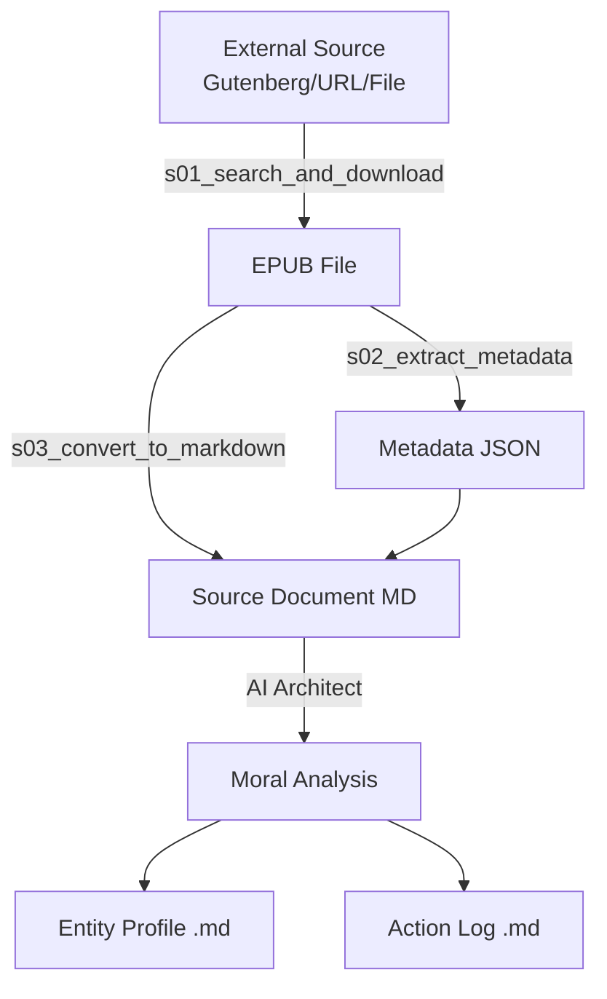
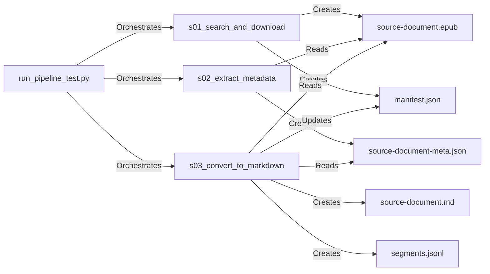

# Repository Analysis: UMQF / MORA

## 1. Project Overview
This repository hosts the **Universal Moral Quotient Formula (UMQF)** and the **Moral Objective Rating Agent (MORA)** system. It is a specialized software solution designed to objectively quantify the morality of actions using a standardized mathematical formula. The system combines a Python-based data ingestion pipeline with an AI-driven analysis workflow to assess moral implications across diverse entities and scenarios.

## 2. Technology Stack
The project relies on a Python ecosystem for data processing and AI integration for analysis.

### Core Technologies
-   **Language:** Python 3.x
-   **AI Integration:** Roo Code (VS Code Extension) with Large Language Models (e.g., Google Gemini 3 Pro)
-   **Documentation:** Markdown (Standard and Structured)

### Key Dependencies (Python)
-   **`requests`** (>=2.31.0): HTTP library for downloading content.
-   **`beautifulsoup4`** (>=4.12.2): HTML parsing and data extraction.
-   **`lxml`** (>=4.9.3): High-performance XML/HTML processing.
-   **`playwright`** (>=1.40.0): Browser automation for complex web interactions.
-   **`EbookLib`** (>=0.18): Handling EPUB file formats.
-   **`markdownify`** (>=0.11.6): Converting HTML content to Markdown.
-   **`jsonschema`** (>=4.20.0): JSON validation.

### Build & Development Tools
-   **IDE:** Visual Studio Code
-   **Extension:** Roo Code (for AI Agent orchestration)
-   **Version Control:** Git

## 3. Architecture & Patterns
The system follows a **Pipeline Architecture** for data preparation, followed by an **Agentic Workflow** for analysis.

### Architectural Pattern
-   **Data Ingestion Pipeline:** A sequential series of Python scripts transforms raw external data (books, URLs) into a standardized internal format (Markdown SSOT).
-   **Single Source of Truth (SSOT):** The system relies heavily on SSOT principles. `UMQF.md` is the SSOT for the moral formula, and `source-document.md` is the SSOT for the text being analyzed.
-   **Agentic Analysis:** The core business logic (moral assessment) is performed by an AI agent following a strict Standard Operating Procedure (SOP) defined in `.ai/instructions.md`.

### Data Flow Architecture


## 4. Project Structure & Organization
The repository is organized into clear functional modules.

### Top-Level Directories
-   **`MORA/`**: The core application directory.
    -   **`tools/`**: Python scripts implementing the data ingestion pipeline.
    -   **`analysis/`**: Data storage for processed documents. Each document has its own subdirectory containing the source text and generated analysis files.
    -   **`templates/`**: Markdown templates ensuring consistent output formatting for entity profiles.
    -   **`.ai/`**: Configuration and instructions for the AI agents.
    -   **`.roo/`**: Rules and settings for the Roo Code extension.
-   **`.ai/`** (Root): Repository-level AI instructions and analysis artifacts.

### Key Files
-   **`UMQF.md`**: The core documentation defining the Universal Moral Quotient Formula.
-   **`MORA/requirements.txt`**: Python dependency definitions.
-   **`MORA/tools/run_pipeline_test.py`**: Interactive runner for the ingestion pipeline.

## 5. Component Interactions & Dependencies
The system components interact through file-based data exchange.

### Pipeline Dependencies


### Documentation Taxonomy
```mermaid
graph TD
    Root[Repository Root] --> Formula[UMQF.md<br/>(Formula SSOT)]
    Root --> Readme[README.md<br/>(System Overview)]
    Root --> AgentInst[MORA/.ai/instructions.md<br/>(Agent SOP)]
    
    AgentInst -->|References| Formula
    AgentInst -->|Governs| Output
    
    Output[Analysis Output] --> Entity[Entity Profile]
    Output --> Action[Action Log]
```

## 6. Development Environment Requirements
To contribute to or run this project, the following environment is required:

### Prerequisites
-   **Operating System:** Windows, macOS, or Linux (Windows/PowerShell detected in current context).
-   **Python:** Version 3.x installed and added to PATH.
-   **Visual Studio Code:** Recommended editor.
-   **Roo Code Extension:** Required for executing the AI analysis phase.

### Setup Instructions
1.  Clone the repository.
2.  Navigate to `MORA/`.
3.  Install dependencies: `pip install -r requirements.txt`.
4.  (Optional) Install Playwright browsers: `playwright install`.

### Testing & Execution
-   **Pipeline Test:** Run `python tools/run_pipeline_test.py` to interactively test the data ingestion process.
-   **Analysis:** Open a document folder in VS Code and use Roo Code with the prompt: "Execute a full Morality Assessment for..."

## 7. Key Architectural Decisions
-   **Decoupled Ingestion and Analysis:** The Python pipeline handles deterministic data formatting, while the AI handles probabilistic semantic analysis. This separation ensures that the AI always works with clean, standardized text.
-   **File-Based State:** The system uses the file system as its database (Markdown, JSON). This simplifies version control and allows for easy manual inspection of intermediate states.
-   **Explicit Context Management:** The use of `segments.jsonl` and `utils_extract_segment.py` demonstrates a deliberate architectural choice to handle large texts by breaking them into context-window-friendly chunks.

